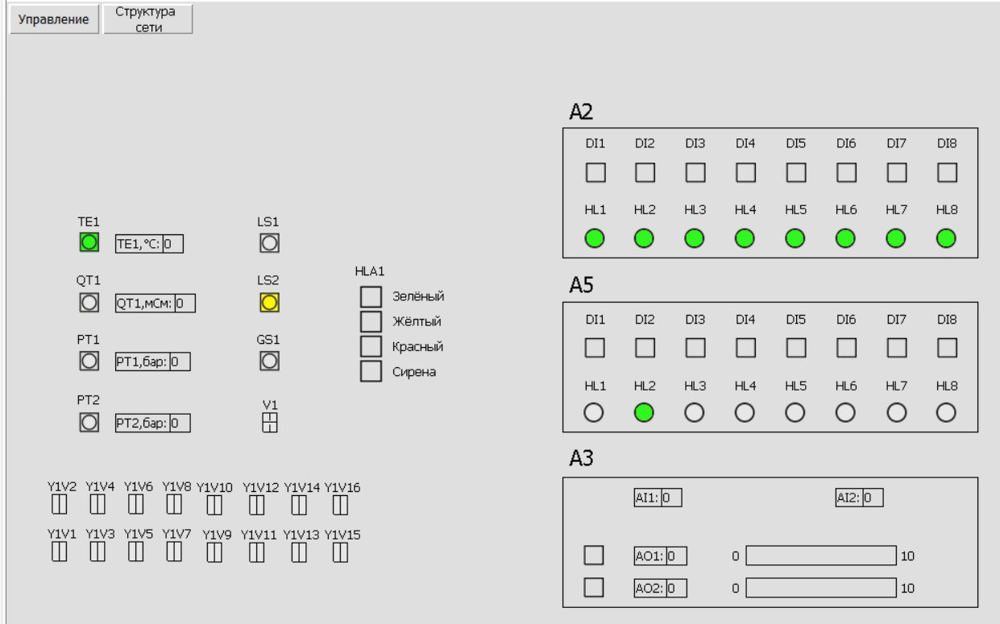

<p align="center">Министерство образования Республики Беларусь</p>
<p align="center">Учреждение образования</p>
<p align="center">«Брестский государственный технический университет»</p>
<p align="center">Кафедра ИИТ</p>
<br><br><br><br><br><br><br>
<p align="center">Лабораторная работа №5</p>
<p align="center">По дисциплине «Теория и методы автоматического управления»</p>
<p align="center">Тема: «Работа с контроллером AXC F 2152»</p>
<br><br><br><br><br>
<p align="right">Выполнил:</p>
<p align="right">Студент 3-го курса</p>
<p align="right">Группы АС-65</p>
<p align="right">Гуща И.В.</p>
<p align="right">Проверил:</p>
<p align="right">Дворанинович Д.А.</p>
<br><br><br><br><br>
<p align="center">Брест 2025</p>

---

# Задание:
1. Ознакомиться с общей информацией о платформе **PLCnext** [здесь](https://www.plcnext.help/te/About/Home.htm).

2. Изучить проект [T1-PLCnext-Demo](https://github.com/savushkin-r-d/T1-PLCnext-Demo).

3. Внести изменения в описание ([main.plua](https://github.com/savushkin-r-d/T1-PLCnext-Demo/blob/master/main.plua)) управляющей программы .

4. Развернуть данный проект локально и на тестовом контроллере и продемонстрировать работу.

5. Написать отчет по выполненной работе в .md формате (readme.md) и с помощью pull request разместить его в следующем каталоге: trunk\as000xxyy\task_05\doc.

# Ход работы

## Подготовка

1.Скачать и установить последнюю версию приложения [Git LFS](https://git-lfs.com/).

2. Клонируем репозиторий T1-PLCnext-Demo в локальный каталог D:/5:
```sh
git clone --recurse-submodules https://github.com/savushkin-r-d/T1-PLCnext-Demo
```

3. После этого клонируем репозиторий, содержащий компоненты **EasyServer**,
**Monitor** и **DbEditorXML**, выполнив команду:
```sh
git clone --recurse-submodules https://github.com/savushkin-r-d/SCADA-ptusa-bin
```
Эти команды нужны для установки проектов с необходимыми подмодулями.

4. Следующий шаг — настройка **DbEditorXML**. Запустите **DbEditorXML.exe**,
добавьте драйвер *T1_PLCNext_Demo.cdbx* и убедитесь, что IP-адрес установлен на 
`192.168.1.10`. После этого нужно выйти из редактора, чтобы изменения сохранились.
Данный IP-адрес соответствует контроллеру.
5. Потом необходимо настроить **EasyServer**. Он находиться в той же папке, что и **DbEditorXML**. Т.е.
в проекте *SCADA-ptusa-bin*. Запускаем сервер. В появившемся окне нажимаем "Настройки сервера"
выбираем "D:\5\SCADA-ptusa-bin\chbase" для пути к базе каналов. 
В настройки проектов добавляем *"T1_PLCNext_Demo.mpr"* по адресу *D:\5\SCADA-ptusa-bin\projects*.
В настройки базы каналов файл **T1_PLCNext_Demo.cdbx** по адресу *D:\5\SCADA-ptusa-bin\chbase*
Принимаем изменения нажав **ОК**.
Во вкладке база каналов нажимаем **загрузить** и выбираем последний загруженный файл.
Во вкладке проекты отрываем требуемы проект *T1_PLCNext_Demo.mpr.*
6. Установка и настройка Monitor.
Monitor находится в папке вместе с **EasyServer** и **DbEditorXML**.
Необходимо запустить файл Monitor.exe.
В окне "Меню проектов" нажимаем кнопку "Добавить" и выбираем файл T1_PLCNext_Demo.mpr .
Далее выбираем проект "T1_PLCNext_Demo" и нажимаем кнопку "Открыть".
В появившемся окне вводим пользователь user и сервер localhost или
127.0.0.1.

## Запуск на контроллере

Чтобы запустить данный проект на контроллере, требуется результат 4 лабораторной работы.
Собранный проект ptusa_main уже находится на контроллере со всеми необходимыми файлами и библиотеками,
которые требуются для запуска. 
Прошлый раз столкнулись с ошибкой EasyServer, так как он не был подключен, соответственно
программа и не могла его видеть. 
После данных изменений можем запускать проект командой *./ptusa_main  main.plua  sys_path ./sys/*.

Но перед этим необходимо заменить содержимое файла main.plua. Например, лампы группы А2 
постоянно светяться, а А5 моргают поочередно.
```lua
-- Проект 'T1-PLCnext-Demo'
-- A2 - всегда включены
-- A5 - мигают поочередно
prg = require("prg")
require("./sys/sharedmodbus")
------------------------------------------------------------------------------
-- Настройки
local BLINK_TIME = 300   -- время свечения одной лампы A5 (мс)
-----------------------------------------------------------------------------
-- Переменные
local last_time = 0
local current_lamp = 1
------------------------------------------------------------------------------
-- Инициализация (один раз)
function user_init()
    last_time = get_millisec()
end
------------------------------------------------------------------------------
-- Основной цикл (каждый цикл ПЛК)

function user_eval()
    --------------------------------------------------------------------------
    -- A2: всегда включены
    A2HL1:set_state(1)
    A2HL2:set_state(1)
    A2HL3:set_state(1)
    A2HL4:set_state(1)
    A2HL5:set_state(1)
    A2HL6:set_state(1)
    A2HL7:set_state(1)
    A2HL8:set_state(1)
    --------------------------------------------------------------------------
    -- A5: бегущее мигание
    if get_delta_millisec(last_time) >= BLINK_TIME then
        -- Выключаем все A5
        A5HL1:set_state(0)
        A5HL2:set_state(0)
        A5HL3:set_state(0)
        A5HL4:set_state(0)
        A5HL5:set_state(0)
        A5HL6:set_state(0)
        A5HL7:set_state(0)
        A5HL8:set_state(0)
        -- Включаем текущую лампу
        if current_lamp == 1 then A5HL1:set_state(1)
        elseif current_lamp == 2 then A5HL2:set_state(1)
        elseif current_lamp == 3 then A5HL3:set_state(1)
        elseif current_lamp == 4 then A5HL4:set_state(1)
        elseif current_lamp == 5 then A5HL5:set_state(1)
        elseif current_lamp == 6 then A5HL6:set_state(1)
        elseif current_lamp == 7 then A5HL7:set_state(1)
        elseif current_lamp == 8 then A5HL8:set_state(1)
        end
        -- Переход к следующей лампе
        current_lamp = current_lamp + 1
        if current_lamp > 8 then
            current_lamp = 1
        end
        last_time = get_millisec()
    end
end
------------------------------------------------------------------------------
-- Инициализация параметров
function user_init_params()
end
```

После запуска проекта на контроллере необходимо переподключиться к монитору и можем убедиться
в том, что лампочки моргают так, как это предусматривалось.



Вывод: работа проекта ptusa_main продемонстрирована при помощи проектов "T1-PLCnext-Demo" и "SCADA-ptusa-bin".
В программе монитора продемонстрирован управляющий скрипт.
