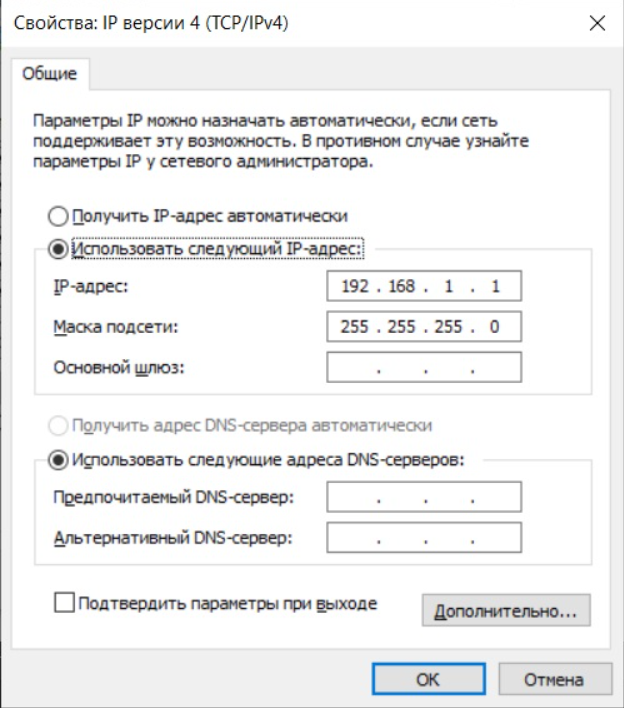
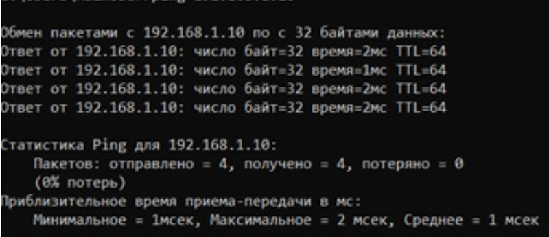
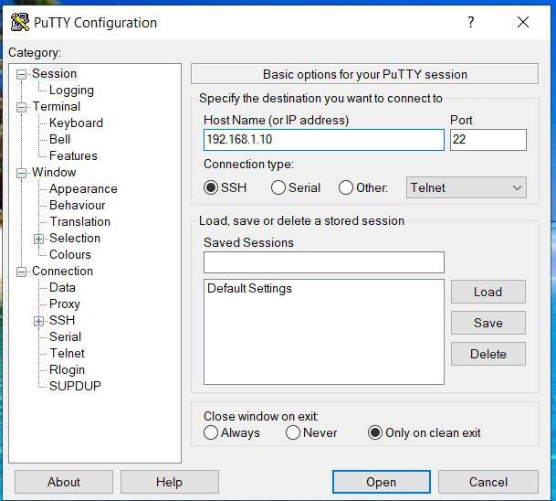
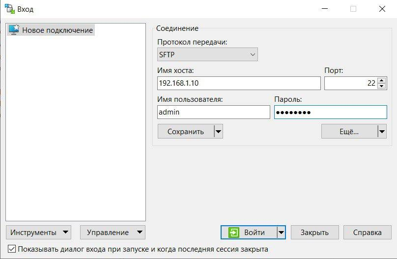
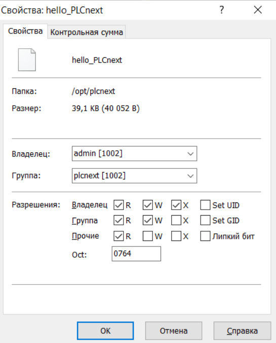

<p align="center">Министерство образования Республики Беларусь</p>
<p align="center">Учреждение образования</p>
<p align="center">“Брестский Государственный технический университет”</p>
<p align="center">Кафедра ИИТ</p>
<br><br><br><br><br><br>
<p align="center"><strong>Лабораторная работа №3</strong></p>
<p align="center"><strong>По дисциплине</strong> “Теория и методы автоматического управления”</p>
<p align="center"><strong>Тема:</strong> “Работа с контроллером AXC F 2152”</p>
<br><br><br><br><br><br>
<p align="right"><strong>Выполнил</strong>:</p>
<p align="right">Студент 3 курса</p>
<p align="right">Группы АС-65</p>
<p align="right">Кисель М.С.</p>
<p align="right"><strong>Проверил:</strong></p>
<p align="right">Иванюк Д. С.</p>
<br><br><br><br><br>
<p align="center"><strong>Брест 2025</strong></p>

---
<p> <strong>Цель:</strong> создать тестовый проект "Hello PLCnext from AS0xxyy!", собрать его и продемонстрировать работоспособность на тестовом контроллере.</p> 

<p> <strong>Решение:</strong> </p>

<p>1. Установить PLCnext Toolchain 2024.6 и проверить командой:</p>

* Официальная ссылка: *Phoenix Contact → PLCnext → Downloads*
* Необходим пакет: **PLCnext Toolchain for Windows 2024.6**

Установить Toolchain, например в папку:

```
D:\TMAU_Lab3\PLCnext_Toolchain
```

Проверить:
```powershell
plcncli --version
```

<p>2. Установить SDK для AXCF2152:</p>

Скачать SDK:

* **AXCF 2152 SDK 2024.6**
* Файл бывает формата *.zip* или *.tar.gz*

Распаковать в:

```
D:\PLCnextSDK\AXCF2152_2024_6
```

Важно: внутри должны быть папки:

```
sysroots\
cmake\
toolchain.cmake
```

Установить SDK для AXCF2152:
```powershell
plcncli install sdk -d "D:\PLCnextSDK\AXCF2152_2024_6" -p "D:\TMAU_Lab3\AXC_F_2152_SDK_2024_6\axcf2152-mingw_sdk-2024.6.0-24.6.0.81.tar.xz"
```

<p>Проверка:</p>

```powershell
plcncli get targets
```

Ожидаемый вывод:

```json
{
  "targets": [
    {
      "name": "AXCF2152",
      "version": "24.6.0.81",
      "longVersion": "2024.6.0 (24.6.0.81)",
      "shortVersion": "24.6.0"
    }
  ]
}
```

<p>3. Клонировать шаблон проекта:</p>

```powershell
git clone https://github.com/savushkin-r-d/PLCnext-howto
```

После клонирования структура будет:

```
D:\PLCnext-howto\
   └── HowTo build program Hello PLCnext\
         └── Hello-PLCnext\
               ├── src\main.cpp
               ├── CMakeLists.txt
               └── CMakePresets.json
```

<p>4. Настроить <em>CMakePresets.json</em> для SDK 2024.6:</p>

```json
{
    "name": "build-windows-AXCF2152-2024.6",
    "inherits": "default",
    "displayName": "AXCF2152-2024.6",
    "environment": {
        "ARP_DEVICE": "AXCF2152",
        "ARP_DEVICE_VERSION": "2024.6.0 (24.6.0.81)",
        "PLCNEXT_SDK_ROOT": "D:/PLCnextSDK/AXCF2152_2024_6"
    },
    "cacheVariables": {
        "CMAKE_TOOLCHAIN_FILE": {
            "value": "$env{PLCNEXT_SDK_ROOT}/toolchain.cmake",
            "type": "FILEPATH"
        }
    }
}
```

Важно:

* **ARP_DEVICE_VERSION = "2024.6.0 (24.6.0.81)"**, а не "24.6.0.81" и не просто "2024.6.0".

<p>5. Сборка проекта:</p>

```powershell
cmake --preset build-windows-AXCF2152-2024.6 .
cmake --build --preset build-windows-AXCF2152-2024.6 --target all
cmake --build --preset build-windows-AXCF2152-2024.6 --target install
```

<p>6. Итоговый бинарный файл:</p>

```
D:\PLCnext-howto\HowTo build program Hello PLCnext\Hello-PLCnext\deploy\
      AXCF2152_24.6.0.81\Release\bin\hello_PLCnext
      
```
<p>Это исполняемый ELF-файл, который можно запускать на контроллере AXCF2152 под PLCnext OS.</p>

<p>7. Подключаемся к контроллеру и настраиваем сеть.</p>
При невозможности подключения контроллера по Ethernet ввиду отсутствия у автора отчета необходимого разъема. Работа выполнялась при помощи компьютера коллеги 


 

Важно: IP-адрес не 192.168.1.1, а 192.168.1.10!!!

<p>Проверяем подключение к контроллеру.</p>

  

<p>Открываем программу <em>PuTTY Configuration</em> и подключаемся к контроллеру.</p>

 

<p>Вводим логин и пароль для подключения к контроллеру.</p>

```
login as: admin
Pre-authentication banner message from server:
Hinweis:
Dieses Gerät darf nur von autorisierten Benutzern für autorisierte Zwecke verwendet werden. Ihre Anmeldeinformationen und alle Benutzeraktionen auf diesem Gerät können überwacht, aufgezeichnet, kopiert und auditiert werden.
Durch die weitere Verwendung dieses Geräts erklären Sie sich mit diesen Bedingungen einverstanden.
Notice:
This device may only be used by authorized users for authorized purposes. Your credentials and all user actions on this device can be monitored, recorded, copied and audited. By continuing to
use this device, you agree to these terms.
• End of banner message from server
admin@192.168.1.10's password:
admin@axcf2152: ~$
```

<p>Открываем программу <em>WinCP</em> и подключаемся к контроллеру.</p>

 

<p>Добавляем собранный проект в корень контролера и меняем его разрешения, для запуска.</p>

 

Для корректного запуска даем все права, нажимая на все галочки

<p>Запускаем проект и получаем следующий вывод.</p>

Перед запуском файл был переименован с hello_PLCnext на hello_PLCnext_Bel, с целью избежания дублирования файлов в папке (файл с названием hello_PLCnext до этого уже присутствовал в папке)

```
admin@axcf2152:/opt/plcnext$ ./hello_PLCnext_Bel
Hello PLCnext from as006508!
admin@axcf2152:/opt/plcnext$
```

<p> <strong> Вывод:</strong> В ходе данной лабораторной работы был создан тестовый проект "Hello PLCnext from AS006508!" и получены знания для работы с контроллером <em>AXC F 2152</em></p>
