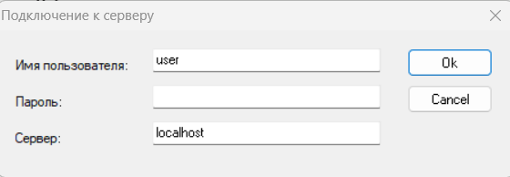
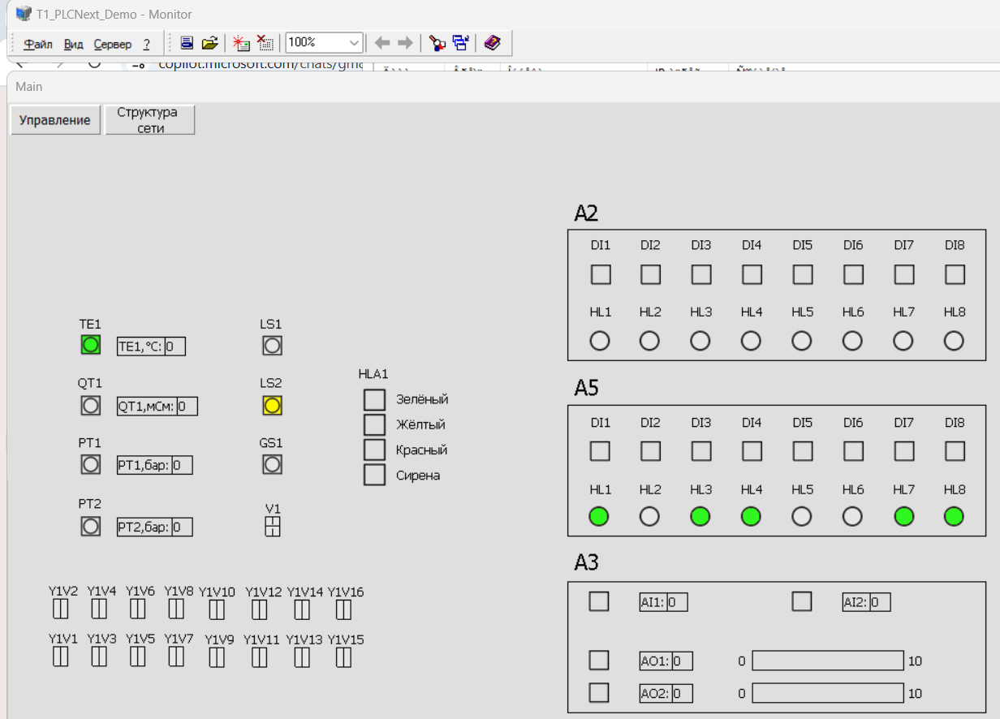
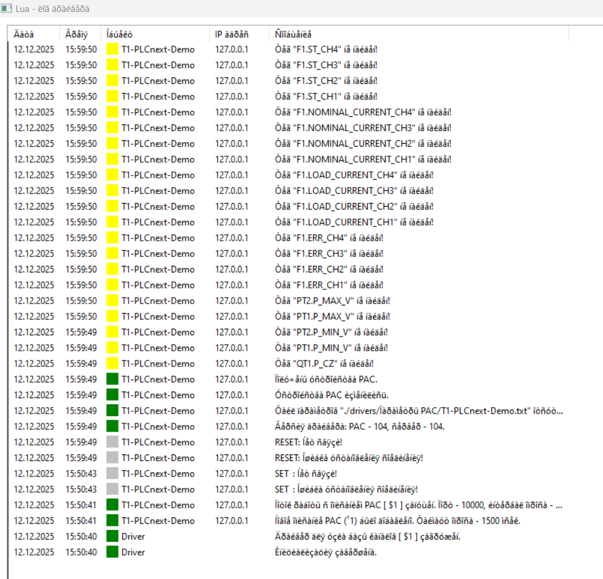

 align="center">Министерство образования Республики Беларусь</p>
<p align="center">Учреждение образования</p>
<p align="center">“Брестский Государственный технический университет”</p>
<p align="center">Кафедра ИИТ</p>
<br><br><br><br><br><br>
<p align="center"><strong>Лабораторная работа №5</strong></p>
<p align="center"><strong>По дисциплине</strong> “Теория и методы автоматического управления”</p>
<p align="center"><strong>Тема:</strong> “Работа с контроллером AXC F 2152”</p>
<br><br><br><br><br><br>
<p align="right"><strong>Выполнил</strong>:</p>
<p align="right">Студент 3 курса</p>
<p align="right">Группы АС-65</p>
<p align="right">Кисель М.С.</p>
<p align="right"><strong>Проверил:</strong></p>
<p align="right">Иванюк Д. С.</p>
<br><br><br><br><br>
<p align="center"><strong>Брест 2025</strong></p>

---
# Задание:
Развернуть проект **T1-PLCnext-Demo** локально и на тестовом контроллере и продемонстрировать работу. Также внести изменения в описание управляющей программы.

# Ход работы

## Развернуть проект **T1-PLCnext-Demo** локально

### Подготовка

1. **Клонирование репозитория**:
   
   ```sh
   git clone --recurse-submodules https://github.com/savushkin-r-d/T1-PLCnext-Demo
   ```

2. **Установка Git LFS**:
   - Скачать и установить последнюю версию приложения [Git LFS](https://git-lfs.com/).

3. **Клонирование репозитория с компонентами**:
   
   ```sh
   git clone --recurse-submodules https://github.com/savushkin-r-d/SCADA-ptusa-bin
   ```

4. **Настройка DbEditorXML**:
   - Запустить **DbEditorXML.exe**.
   - Добавить драйвер *T1_PLCNext_Demo.cdbx*.
   - Убедиться, что IP-адрес установлен на `127.0.0.1`.
   - Запустить **Bugger.exe** для проверки корректности загрузки сервера.

5. **Настройка EasyServer**:
   - Запустить **EasyServer** из клонированного репозитория.
   - Следуя [инструкции](https://github.com/savushkin-r-d/T1-PLCnext-Demo?tab=readme-ov-file#клонирование-проекта), настроить файл.
   - Запустить проект по адресу (в моем случае): `"C:\Users\kseni\Documents\GitHub\SCADA-ptusa-bin\projects\T1_PLCNext_Demo.mpr"`.

6. **Настройка Monitor**:
   - Запустить **Monitor.exe**.
   - В меню проектов добавить файл *T1_PLCNext_Demo.mpr*.
   - Открыть проект с данными `Имя пользователя` - `user` и `Сервер` - `localhost`.



### Сборка и запуск для Visual Studio 2022

- Запустить Visual Studio, выбрать открыть локальную папку->D:\ ...\ptusa_main (из прошлой лабораторной работы №4)
- Сверху в управлении конфигурациями выбрать Windows Debug(windows-VS2022-debug-build-windows-VS2022-debug)
- выбрать элемент запуска ptusa_main.exe(Debug\ptusa_main.exe)
- далее необходимо перейти в Отладка->Параметры отладки и запуска для ptusa_main> и дополнить содержимое файла launch.vs.json, прописывая собственные пути к файлам

В моем случае файл launch.vs.json должен иметь вид:

```
{
  "version": "0.2.1",
  "defaults": {},
  "configurations": [
    {
      "type": "default",
      "project": "CMakeLists.txt",
      "projectTarget": "ptusa_main.exe (Debug\\ptusa_main.exe)",
      "name": "ptusa_main.exe (Debug\\ptusa_main.exe)",
      "currentDir": "d:/TMAU/TMAU_Lab5/T1-PLCnext-Demo",
      "args": [
        "--path",
        "d:/TMAU/TMAU_Lab5/T1-PLCnext-Demo/",
        "--sys_path",
        "d:/TMAU/TMAU_Lab5/T1-PLCnext-Demo/sys/",
        "--extra_paths",
        "d:/TMAU/TMAU_Lab5/T1-PLCnext-Demo/dairy-sys/",
        "--debug",
        "d:/TMAU/TMAU_Lab5/T1-PLCnext-Demo/main.plua"
      ]
    }
  ]
}
```

  После чего запустить:

  программу в режиме отладки (F5)
  
  EasyServer
  
  Monitor


**Проверка работы**:
   - В **Monitor** будут видны все устройства проекта тестового стенда *T1_PLCNext_Demo* с возможностью управления.



  - В **EasyServer** появятся:

  

   - Вывод  в консоль после отладки будет следующий:

```
2025-12-12 15.59.46 INFO   (6) -> Program started (version 2025.12.1.0).
DEBUG ON.
2025-12-12 15.59.46 WARNING(4) -> Bus couplers are disabled.
2025-12-12 15.59.46 DEBUG  (7) -> Init Lua...
2025-12-12 15.59.46 NOTICE (5) -> script_name = "d:/TMAU/TMAU_Lab5/T1-PLCnext-Demo/main.plua"
2025-12-12 15.59.46 NOTICE (5) -> current working directory: "d:\TMAU\TMAU_Lab5\T1-PLCnext-Demo"
2025-12-12 15.59.46 NOTICE (5) -> path = "d:/TMAU/TMAU_Lab5/T1-PLCnext-Demo/", sys_path = "d:/TMAU/TMAU_Lab5/T1-PLCnext-Demo/sys/", extra_paths = "d:/TMAU/TMAU_Lab5/T1-PLCnext-Demo/dairy-sys/"
???????? ??????? ? ?????? ????????.
2025-12-12 15.59.46 NOTICE (5) -> File "d:/TMAU/TMAU_Lab5/T1-PLCnext-Demo/sys/sys.io.lua" version 2.
2025-12-12 15.59.46 NOTICE (5) -> File "d:/TMAU/TMAU_Lab5/T1-PLCnext-Demo/sys/sys.devices.lua" version 2.
2025-12-12 15.59.46 NOTICE (5) -> File "d:/TMAU/TMAU_Lab5/T1-PLCnext-Demo/sys/sys.objects.lua" version 8.
2025-12-12 15.59.46 NOTICE (5) -> File "d:/TMAU/TMAU_Lab5/T1-PLCnext-Demo/main.io.lua" version 1.
2025-12-12 15.59.46 NOTICE (5) -> File "d:/TMAU/TMAU_Lab5/T1-PLCnext-Demo/main.objects.lua" version 1.
2025-12-12 15.59.46 NOTICE (5) -> File "d:/TMAU/TMAU_Lab5/T1-PLCnext-Demo/main.modbus_srv.lua" version 1.
2025-12-12 15.59.46 NOTICE (5) -> File "d:/TMAU/TMAU_Lab5/T1-PLCnext-Demo/main.profibus.lua" version 1.
2025-12-12 15.59.46 NOTICE (5) -> File "d:/TMAU/TMAU_Lab5/T1-PLCnext-Demo/main.restrictions.lua" version 1.
?????????? ????????? ???????? sys.lua.
??????? ? Lua ??????????? ????????.
???????? ??????????.
?????????? ????????? ?????????????.

Project manager - processing configuration...
I\O manager [2]:
"A1" - type 201, number 1, IP "192.168.1.10", DI 0 [0], DO 0 [0], AI 0 [0], AO 0 [0].
"A100" - type 200, number 2, IP "192.168.1.11", DI 1600 [200], DO 1600 [200], AI 100 [200], AO 100 [200].

Set string property SIGNALS_SEQUENCE value GYRA
O?.
Device manager [64]:
      1. V1
      2. V2
      3. Y1V1                 ?????? ??????
      4. Y1V10                ?????? ??????
      5. Y1V11                ?????? ??????
      6. Y1V12                ?????? ??????
      7. Y1V13                ?????? ??????
      8. Y1V14                ?????? ??????
      9. Y1V15                ?????? ??????
     10. Y1V16                ?????? ??????
     11. Y1V2                 ?????? ??????
     12. Y1V3                 ?????? ??????
     13. Y1V4                 ?????? ??????
     14. Y1V5                 ?????? ??????
     15. Y1V6                 ?????? ??????
     16. Y1V7                 ?????? ??????
     17. Y1V8                 ?????? ??????
     18. Y1V9                 ?????? ??????
     19. LS1
     20. LS2
     21. TE1
     22. GS1
     23. FQT1
     24. QT1
     25. A2HL1
     26. A2HL2
     27. A2HL3
     28. A2HL4
     29. A2HL5
     30. A2HL6
     31. A2HL7
     32. A2HL8
     33. A5HL1
     34. A5HL2
     35. A5HL3
     36. A5HL4
     37. A5HL5
     38. A5HL6
     39. A5HL7
     40. A5HL8
     41. A2DI1
     42. A2DI2
     43. A2DI3
     44. A2DI4
     45. A2DI5
     46. A2DI6
     47. A2DI7
     48. A2DI8
     49. A5DI1
     50. A5DI2
     51. A5DI3
     52. A5DI4
     53. A5DI5
     54. A5DI6
     55. A5DI7
     56. A5DI8
     57. A3AI1
     58. A3AI2
     59. A3AO1
     60. A3AO2
     61. PT1
     62. PT2
     63. F1
     64. HLA1

Technological objects manager [0]:

????????? ???????????? Profibus DP slave...
O?.
Project manager - processing configuration completed.
?????????? ????????? ??????? ("d:/TMAU/TMAU_Lab5/T1-PLCnext-Demo/main.plua").
Check shared devices
?????????? ???????????????? ??????? ?????????????.
tcp_communicator_windows:net_init() - master socket [ 556 ] created.
tcp_communicator_windows:net_init() - modbus socket created. Has number 264
Host name - "LAPTOP-MO1K69K5".
Host socket - "192.168.1.1":10000.
PAC name  - "T1-PLCnext-Demo" ("new_project").
????????????? ?????????? ??? ?????????????.
2025-12-12 15.59.49 DEBUG  (7) -> Total memory used: 492 of 30720 bytes[ 1.60% ].
Init Lua Ok.
2025-12-12 15.59.49 INFO   (6) -> Starting main loop! Sleep time is 2 ms.
Accepted connection on 804 socket from 127.0.0.1.
Max buffer use 7
G_CURRENT_PROTOCOL_VERSION = 104, host =[T1-PLCnext-Demo]
Max buffer use 94
Max buffer use 791
2025-12-12 16.00.00 INFO   (6) -> Main control cycle performance : avg = 109, max =  126, tresh =  300 ms (  97 cycles, Lua mem = 345058 b).
```


## Измененный файл `main.plua`

```lua
--Проект 'T1-PLCnext-Demo'

prg = require("prg")                        --Технологические объекты.
require( "sharedmodbus" )                   --Межконтроллерный обмен
------------------------------------------------------------------------------
------------------------------------------------------------------------------
--Пользовательская функция инициализации, выполняемая однократно в PAC.

A5HL1_info = { lamp = A5HL1 }
A5HL2_info = { lamp = A5HL2 }
A5HL3_info = { lamp = A5HL3 }
A5HL4_info = { lamp = A5HL4 }
A5HL5_info = { lamp = A5HL5 }
A5HL6_info = { lamp = A5HL6 }
A5HL7_info = { lamp = A5HL7 }
A5HL8_info = { lamp = A5HL8 }

function user_init()
    local delay = 5000
    local delta = 200

    A5HL1_info.start_time = get_millisec()
    A5HL2_info.start_time = A5HL1_info.start_time - delta
    A5HL3_info.start_time = A5HL2_info.start_time - delta
    A5HL4_info.start_time = A5HL3_info.start_time - delta
    A5HL5_info.start_time = A5HL4_info.start_time - delta
    A5HL6_info.start_time = A5HL5_info.start_time - delta
    A5HL7_info.start_time = A5HL6_info.start_time - delta
    A5HL8_info.start_time = A5HL7_info.start_time - delta
end

function blink( info )
    if get_delta_millisec( info.start_time ) > 2000 then
        if info.lamp:get_state() == 1 then info.lamp:set_state( 0 ) else info.lamp:set_state( 1 ) end
        info.start_time = get_millisec()
    end
end

-- Новая функция: быстрое мигание лампы
function blink_fast(info)
    if get_delta_millisec(info.start_time) > 500 then
        if info.lamp:get_state() == 1 then info.lamp:set_state(0) else info.lamp:set_state(1) end
        info.start_time = get_millisec()
    end
end
------------------------------------------------------------------------------
------------------------------------------------------------------------------
--Пользовательская функция, выполняемая каждый цикл в PAC.


function user_eval()
    -- Управление лампами A2 по состоянию дискретных входов
    A2HL1:set_state( A2DI1:get_state() )
    A2HL2:set_state( A2DI2:get_state() )
    A2HL3:set_state( A2DI3:get_state() )
    A2HL4:set_state( A2DI4:get_state() )
    A2HL5:set_state( A2DI5:get_state() )
    A2HL6:set_state( A2DI6:get_state() )
    A2HL7:set_state( A2DI7:get_state() )
    A2HL8:set_state( A2DI8:get_state() )

    -- Теперь оба аналоговых выхода повторяют значения входов
    A3AO1:set_value( A3AI1:get_value() )
    A3AO2:set_value( A3AI2:get_value() )

    -- Мигание ламп на A5: часть медленно, часть быстро
    blink( A5HL1_info )
    blink( A5HL2_info )
    blink_fast( A5HL3_info )  -- новая логика
    blink_fast( A5HL4_info )  -- новая логика
    blink( A5HL5_info )
    blink( A5HL6_info )
    blink_fast( A5HL7_info )  -- новая логика
    blink_fast( A5HL8_info )  -- новая логика

    -- Логика сигнализации по порогам
    local GREEN_MIN = 0.3
    local YELLOW_MIN = 3
    local RED_MIN = 6

    if A3AI1:get_value() < GREEN_MIN then
        HLA1:off()
    elseif A3AI1:get_value() >= GREEN_MIN and A3AI1:get_value() < YELLOW_MIN then
        HLA1:turn_off_red()
        HLA1:turn_off_yellow()
        HLA1:normal_blink_green()
    elseif A3AI1:get_value() >= YELLOW_MIN and A3AI1:get_value() < RED_MIN then
        HLA1:off()
        HLA1:turn_on_yellow()
    elseif A3AI1:get_value() >= RED_MIN then
        HLA1:off()
        HLA1:turn_on_red()
    end
end
------------------------------------------------------------------------------
------------------------------------------------------------------------------
--Функция инициализации параметров, выполняемая однократно в PAC.

function user_init_params()
end
------------------------------------------------------------------------------
------------------------------------------------------------------------------
```

## Описание изменения

###1. Добавление управления вторым аналоговым выходом A3AO2

Изменение: В функцию user_eval добавлена строка:

```lua
A3AO2:set_value( A3AI2:get_value() )
```

Причина: Изначально использовался только один аналоговый канал. Добавление второго делает программу более полной и демонстрирует работу с несколькими аналоговыми сигналами.

Результат: В Monitor можно изменять значение A3AI2 и видеть, как оно напрямую отображается на A3AO2.

### 2. Добавление новой функции blink_fast(info)

Изменение: В код добавлена функция:

```lua
function blink_fast(info)
    if get_delta_millisec(info.start_time) > 500 then
        if info.lamp:get_state() == 1 then info.lamp:set_state(0) else info.lamp:set_state(1) end
        info.start_time = get_millisec()
    end
end
```

и вызовы этой функции для некоторых ламп (A5HL3, A5HL4, A5HL7, A5HL8).

Причина: В исходном проекте все лампы мигали с одинаковым интервалом (2000 мс). Добавление функции быстрого мигания (500 мс) демонстрирует понимание принципа работы и умение расширять функциональность.

Результат: В Monitor теперь видно, что часть ламп мигает быстрее, а часть — медленнее. Это делает поведение системы более разнообразным и наглядным.

## Запуск на контроллере

Для запуска на контроллере необходим файл _ptusa_main_ - результат Лабораторной работы №4. Там же указана инструкция для сборки и подключения.

```
^Cadmin@axcf2152:/opt/main$ ./ptusa main main.plua sys path ./ sys/
2023-12-20 03.57.35 INFO (6) -> Program started (version 2025.12.1.0).
2023-12-20 03.57.35 WARNING (4) -> Bus couplers are enabled.
2023-12-20 03.57.35 NOTICE (5) -> script name = "main plua"
2023-12-20 03.57.35 NOTICE (5) -> current working directory: "/opt/main"
2023-12-20 03.57.35 NOTICE (5) -> path = ".", sys_path = "./sys", extra_paths = "./dairy-sys"
Check shared devices
2023-12-20 03.57.35 DEBUG (7) -> Total memory used: 492 of 30720 bytes[ 1.60% ].
2023-12-20 03.57.35 INFO (6) -> Starting main loop! Sleep time is 2 ms.
2023-12-20 03.57.36 CRITIC (2) -> Network device : s7->"A100": "192.168.1.11" can't connect: timeout(100 ms).
2023-12-20 03.57.37 CRITIC (2) -> Network device : s7->"A100":"192.168.1.11" can't connect : timeout(100 ms).
2023-12-20 03.57.39 CRITIC (2) -> Network device : s7->"A100":"192.168.1.11" can't connect : timeout (100 ms).
2023-12-20 03.57.40 ERROR (3) -> 1-5-5 : Нет связи с EasyServer.
2023-12-20 03.57.41 ERROR (3) -> 1-1-2 : Нет связи с узлом I/0 'A100' ('192.168.1.11', 'T1-PLCnext-Demo' )
```

Перед ошибками шла попытка соединения, а потом вышло время и получились ошибки


### Заключение
Локально проект собрался и запустился, Lua-скрипты выполняются, изменения (A3AO2, blink_fast) работают. На контроллере проект также запускается, но появляются ошибки связи: "Нет связи с EasyServer" — означает, что сервер мониторинга не был запущен или не установлено соединение. "Нет связи с узлом I/O 'A100'" — связано с отсутствием реального модуля ввода-вывода по адресу 192.168.1.11.
