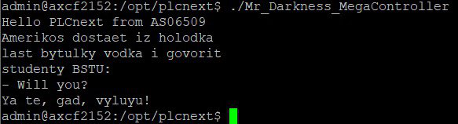

<p align="center">Министерство образования Республики Беларусь</p>
<p align="center">Учреждение образования</p>
<p align="center">“Брестский Государственный технический университет”</p>
<p align="center">Кафедра ИИТ</p>
<br><br><br><br><br><br>
<p align="center"><strong>Лабораторная работа №3</strong></p>
<p align="center"><strong>По дисциплине</strong> “Теория и методы автоматического управления”</p>
<p align="center"><strong>Тема:</strong> “Работа с контроллером AXC F 2152”</p>
<br><br><br><br><br><br>
<p align="right"><strong>Выполнил</strong>:</p>
<p align="right">Студент 3 курса</p>
<p align="right">Группы АС-65</p>
<p align="right">Колбашко А.В.</p>
<p align="right"><strong>Проверил:</strong></p>
<p align="right">Дворанинович Д.А.</p>
<br><br><br><br><br>
<p align="center"><strong>Брест 2025</strong></p>

---

**Задание**

1. Ознакомиться с общей информацией о платформе **PLCnext** [здесь](https://www.plcnext.help/te/About/Home.htm).
2. Изучить [руководство](https://github.com/savushkin-r-d/PLCnext-howto/tree/master/HowTo%20build%20program%20Hello%20PLCnext).
3. Используя **Visual Code** создать тестовый проект *"Hello PLCnext from AS0xxyy!"*, собрать его и продемонстрировать работоспособность на тестовом контроллере.
4. Написать отчет по выполненной работе в .md формате (readme.md) и с помощью pull request разместить его в следующем каталоге: trunk\as000xxyy\task_03\doc.


<p> <strong>Ход работы:</strong> </p>

<p>Первым шагом необходимо изучить и ознакомиться с документаций по проектам PLCnext и PLCnext_howto.</p>

<p>Далее первым шагом будет клонирование репозитория.</p>

<p>Для компиляции файла <em>hello_PLCnext</em> применяем следующие команды:</p>


 ``` bash
cmake --preset=build-windows-AXCF2152-2021.6.0.46 .
```


 ``` bash
cmake --build --preset=build-windows-AXCF2152-2021.6.0.46 --target all
```


 ``` bash
cmake --build --preset=build-windows-AXCF2152-2021.6.0.46 --target install
```

<p>Следующим шагом подключаем контроллер и настраиваем сетевые параметры IPv4.</p>

  

<p>Открываем программу <em>PuTTY Configuration</em> и подключаемся к контроллеру.</p>

 

<p>Вводим логин и пароль для доступа к контроллеру.</p> 

<p>Запускаем <em>WinCP</em>, чтобы подключиться к контроллеру.</p>

<p>Копируем собранный проект в корневую папку контроллера и изменяем его разрешения для возможности запуска.</p>

<p>Запускаем проект и получаем следующий консольный вывод.</p>

 

<p> <strong>Вывод:</strong> В процессе выполнения данной лабораторной работы был создан тестовый проект "Hello PLCnext from AS0xxyy!", что дало возможность получить ценные знания для работы с контроллером <em>AXC F 2152</em>.</p>