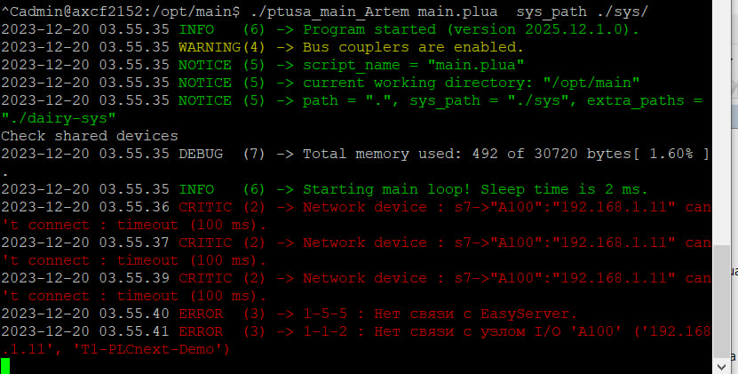

<p align="center">Министерство образования Республики Беларусь</p>
<p align="center">Учреждение образования</p>
<p align="center">“Брестский Государственный технический университет”</p>
<p align="center">Кафедра ИИТ</p>
<br><br><br><br><br><br>
<p align="center"><strong>Лабораторная работа №4</strong></p>
<p align="center"><strong>По дисциплине</strong> “Теория и методы автоматического управления”</p>
<p align="center"><strong>Тема:</strong> “Работа с контроллером AXC F 2152”</p>
<br><br><br><br><br><br>
<p align="right"><strong>Выполнил</strong>:</p>
<p align="right">Студент 3 курса</p>
<p align="right">Группы АС-65</p>
<p align="right">Колбашко А.В.</p>
<p align="right"><strong>Проверил:</strong></p>
<p align="right">Дворанинович Д.А.</p>
<br><br><br><br><br>
<p align="center"><strong>Брест 2025</strong></p>

---
**Задание**

1. Ознакомиться с общей информацией о платформе **PLCnext** [здесь](https://www.plcnext.help/te/About/Home.htm).

2. Изучить проект [ptusa_main](https://github.com/savushkin-r-d/ptusa_main).

3. Используя **Visual Studio** собрать данные проект и продемонстрировать работоспособность на тестовом контроллере.

4. Написать отчет по выполненной работе в .md формате (readme.md) и с помощью pull request разместить его в следующем каталоге: trunk\as000xxyy\task_04\doc.


<p>Для выполнения этой задачи первым шагом является сборка файла <em>ptusa_main</em> в Visual Studio. Для этого необходимо клонировать git-репозиторий со всеми субмодулями</p>

 ``` bash
git clone --recurse-submodules https://github.com/savushkin-r-d/ptusa_main.git
```

<p>После того как репозиторий будет успешно клонирован, можно переходить к сборке проекта.</p>

Первым делом установим необходимые пакеты: [SDK](https://www.phoenixcontact.com/en-fr/products/controller-axc-f-2152-2404267?type=softw&utm_source=qr&utm_medium=print&utm_campaign=product_detection#downloads-link-target).
В данном случае используется версия 2024.6.

Затем нам необходимо изменить файл *CMakePresets.json* в корне проекта ptusa_main.
Для данной версии SDK устанавливаем необходимые пути и версии конфигурации:
```json
  "name": "build-windows-AXCF2152-2024-LTS-Release",
 "displayName": "Windows AXCF2152 2024 LTS Release",
 "description": "Build for AXCF2152 using PLCnext SDK 2024.6",
 "inherits": "windows-AXCF-default",
 "generator": "MinGW Makefiles",

 "environment": {
   "ARP_DEVICE": "AXCF2152",
   "ARP_DEVICE_VERSION": "2024.6.0",
   "ARP_DEVICE_SHORT_VERSION": "2024_6",
   "PLCNEXT_SDK_ROOT": "C:/PLCnextKit/AXCF2152_2024_6",
   "ARP_SDK_PACKAGE_NAME": "x86_64-w64-mingw32"
 },

 "cacheVariables": {
   "CMAKE_TOOLCHAIN_FILE": {
     "value": "C:/PLCnextKit/AXCF2152_2024_6/toolchain.cmake",
     "type": "FILEPATH"
   }
 }
 
 
      "name": "AXCF-default",
      "hidden": true,
      "generator": "MinGW Makefiles",
      "binaryDir": "${sourceDir}/bin/build/$env{ARP_DEVICE}_$env{ARP_DEVICE_SHORT_VERSION}",
      "cacheVariables": {
        "CMAKE_INSTALL_PREFIX": "${sourceDir}/bin/install",
        "CMAKE_TOOLCHAIN_FILE": {
    "value": "C:/PLCnextKit/AXCF2152_2024_6/toolchain.cmake",
    "type": "FILEPATH"
  	},
        "ARP_DEVICE": "AXCF2152",
	"ARP_DEVICE_VERSION": "2024.6.1 (24.6.1.93)",
  	"ARP_DEVICE_SHORT_VERSION": "2024_6",
      }
    }
    
 "name": "build-windows-AXCF2152-2024-LTS-Release",
 "displayName": "Build AXCF2152 (SDK 2024.6)",
 "configurePreset": "build-windows-AXCF2152-2024-LTS-Release"
```
Когда файл изменен, нужно открыть папку с проектом в Visual Studio. В качестве пресета для сборки выбрать 
***Build AXCF2152 (SDK 2024.6)***. Выполним сборку проекта (Ctrl+Shift+B). 

При успешном выполнении получим следующую структуру папок *C:\ptusa_main\bin\build\AXCF2152_2024_6\Release*. 
В ней и будет располагаться собранный бинарный файл ptusa_main.

**Выполнение на контроллере**

Подключение к контроллеру описано в отчете к лабораторной работе №3.

После выполнения подключения в программе PuTTY переходим по 
адресу /opt, где создаем каталог main. С помощью WinSCP помещаем
в данный каталог бинарный файл *ptusa_main*. Там же должны находиться файлы:
- main.io.lua
- main.modbus_srv.lua
- main.objects.lua
- main.plua
- main.profibus.lua
- main.restrictions.lua
- nvram.txt
- prrg.lua
- shared.lua

И системные каталоги:
- spec
- sys


Для файла ptusa_main устанавливаем права доступа.

После запуска получили следующее сообщение:

 

**Вывод:** Проект ptusa_main запускается на тестовом контроллере.