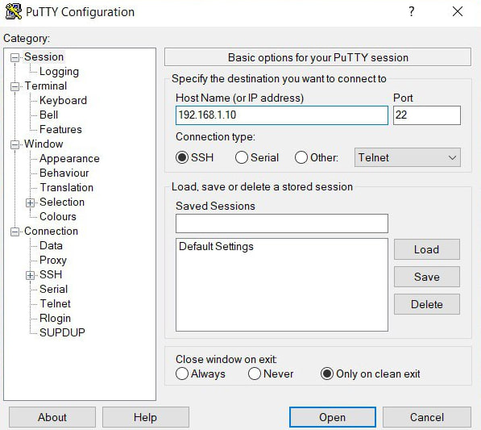
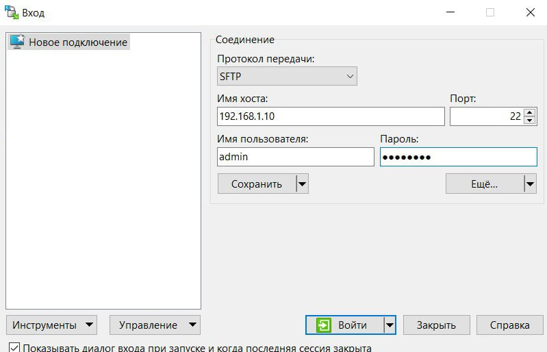

<p align="center"> Министерство образования Республики Беларусь</p>
<p align="center">Учреждение образования</p>
<p align="center">“Брестский Государственный Технический университет”</p>
<p align="center">Кафедра ИИТ</p>
<br><br><br><br><br><br><br>
<p align="center">Лабораторная работа №3</p>
<p align="center">По дисциплине “Теория и методы автоматического управления”</p>
<p align="center">Тема: “Работа с контроллером AXC F 2152”</p>
<br><br><br><br><br>
<p align="right">Выполнил:</p>
<p align="right">Студент 3 курса</p>
<p align="right">Группы АС-65</p>
<p align="right">Нестюк Н.С.</p>
<p align="right">Проверил:</p>
<p align="right">Иванюк Д.С.</p>
<br><br><br><br><br><br><br><br>
<p align="center">Брест 2025</p>

---


# Задание #
1. Ознакомиться с общей информацией о платформе **PLCnext** [здесь](https://www.plcnext.help/te/About/Home.htm).

2. Изучить [руководство](https://github.com/savushkin-r-d/PLCnext-howto/tree/master/HowTo%20build%20program%20Hello%20PLCnext).

3. Используя **Visual Code** создать тестовый проект *"Hello PLCnext from AS0xxyy!"*, собрать его и продемонстрировать работоспособность на тестовом контроллере.

4. Написать отчет по выполненной работе в .md формате (readme.md) и с помощью pull
   request разместить его в следующем каталоге: trunk\as000xxyy\task_03\doc.

## Выполнение работы


### 1. Клонирование репозитория
Склонировал
удаленный [репозиторий](https://github.com/savushkin-r-d/PLCnext-howto.git).

Установил PLCnext_Toolchain (версия 2024.6).

Установил SDK версии 2021_6. разархивировав по пути: *C:\CLI\SDKs\AXCF2152\2021_6*.

Удостоверился в наличии файлов *toolchain.cmake* и *sysroots*.
### 2. Сборка
Чтобы избежать конфликта версий, внес изменения в файл *СMakePresents.json*.

Собрал весь проект и получил бинарный файл *hello_PLCnext_as06512*. В дальнейшем этот исполняемый ETL-файл будет скопирован и запущен на контроллере.

### 3. Запуск на контроллере

Для связи с контролером установил PuTTY (для связи с контроллером) и WinSCP (для передачи файла на контроллер)

Предварительно, для подключения к контроллеру изменил IP-адрес версии 4 для своего Ethernet-порта на **192.168.1.1**.

Подключил контроллер при помощи кабеля Ethernet.

Чтобы удостовериться что подключение прошло успешно — ввел команду *ipconfig*, а затем пропинговал контроллер командой *ping 192.168.1.10* 

Далее в PuTTY ввел IP контроллера (см. на рисунке ниже).


Ввел логин и пароль для подключения к контроллеру:
```
login as: admin
Pre-authentication banner message from server:
Hinweis:
Dieses Gerät darf nur von autorisierten Benutzern für autorisierte Zwecke verwendet werden. Ihre Anmeldeinformationen und alle Benutzeraktionen auf diesem Gerät können überwacht, aufgezeichnet, kopiert und auditiert werden.
Durch die weitere Verwendung dieses Geräts erklären Sie sich mit diesen Bedingungen einverstanden.
Notice:
This device may only be used by authorized users for authorized purposes. Your credentials and all user actions on this device can be monitored, recorded, copied and audited. By continuing to
use this device, you agree to these terms.
• End of banner message from server
admin@192.168.1.10's password:
admin@axcf2152: ~$
```

Открыл программу WinSCP, ввел IP контроллера в поле Host Name и заполнил поля User name и Password (см. рис. снизу).


Проделанное дейсвтие позволило пользоваться файловыми системами и контроллера и ПК одновременно. Скопировал на контроллер собранный проект в корень контроллера и выдал права, прожав все галочки.

Результат запуска проекта представлен ниже:
```
admin@axcf2152:/opt/plcnext$ ./hello_PLCnext_as06512 
Hello PLCnext from AS06512!

kolobok povesilsya
```
**Вывод:** Получил опыт работы с контроллером AXC F 2152.   