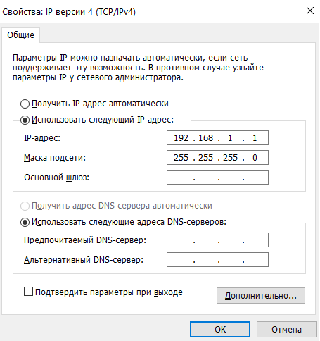
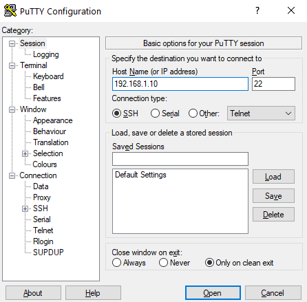
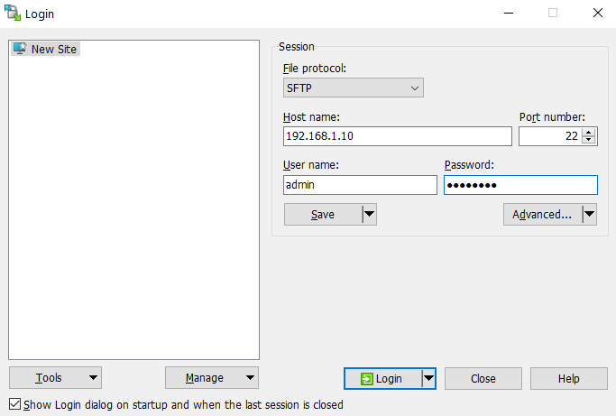
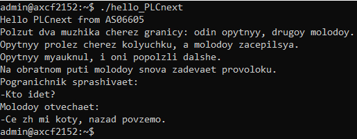

Министерство образования Республики Беларусь

Учреждение образования

«Брестский государственный технический университет»

Кафедра ИИТ

       

Лабораторная работа №3

По дисциплине «Теория и методы автоматического управления»

Тема: «Работа с контроллером AXC F 2152»

     

Выполнил:

Студент 3-го курса

Группы АС-66

Горобец А.В.

Проверил:

Иванюк Д.С.

     

Брест 2025

---

## Задание: 
1.  Ознакомиться с общей информацией о платформе  **PLCnext**.
    
2.  Изучить  руководство.
    
3.  Используя  **Visual Code**  создать тестовый проект  _"Hello PLCnext from AS0xxyy!"_, собрать его и продемонстрировать работоспособность на тестовом контроллере.
    
4.  Написать отчет по выполненной работе в .md формате (readme.md) и с помощью pull request разместить его в следующем каталоге: trunk\as000xxyy\task_03\doc.

## Ход работы

### Установка 
Устанавливаем PuTTY для связи с контроллером. **PuTTY**  — это популярная бесплатная программа для Windows и других систем, которая используется для подключения к удалённым серверам по сетевым протоколам. 
Устанавливаем WinSCP для передачи файла hello_PLCnext на контроллер.  **WinSCP** — это графическая программа для Windows, которая используется для безопасного копирования файлов между локальным компьютером и удалённым сервером.
Устанавливаем PLCnext Toolchain для создания файла hello_PLCnext. **PLCnext Toolchain**  — это набор инструментов для разработки приложений под контроллеры PLCnext.
### Этап подключения и настройки

После получения бинарного файла необходимо подключить контроллер к компьютеру и настроить данные сети.
 

 
| _Новое значение IP-адреса версии 4_

Далее заходим в PuTTY и вводим IP контроллера в поле Host Name
 

 
| _Настройка PuTTY_

После настройки PuTTY запускаем программу WinSCP и вводим IP контроллера в поле Host Name, также заполняем поля User name и Password
 

 
| _Настройка WinSCP_

После настройки связи с контроллером, файл передается на контроллер и, изменяя свойства файла, он делается исполняемым и запускается командой `./hello_PLCnext`
 

 
| _Результат выполнения файла hello_PLCnext_

Столкнулся с проблемой отсутстсвия Ethernet-порта на ноутбуке, проблема была решена путем запуска файла hello_PLCnext на компьютере коллеги. 
