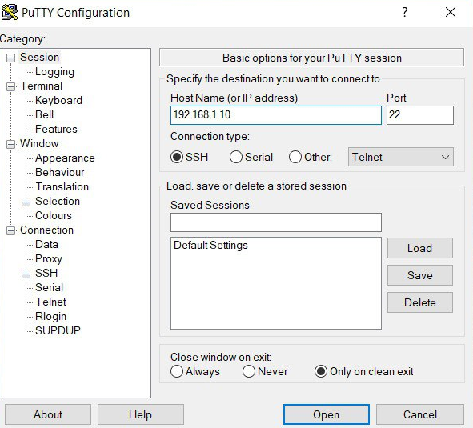

<p align="center">Министерство образования Республики Беларусь</p>
<p align="center">Учреждение образования</p>
<p align="center">“Брестский государственный технический университет”</p>
<p align="center">Кафедра ИИТ</p>
<br><br><br><br><br><br><br>
<p align="center">Лабораторная работа №3</p>
<p align="center">По дисциплине «Теория и методы автоматического управления»</p>
<p align="center">Тема: “Работа с контроллером AXC F 2152”</p>
<br><br><br><br><br><br>​​​​​
<p align="right">Выполнил:</p>
<p align="right">Студент 3 курса</p>
<p align="right">Группы АС-65</p>
<p align="right">Езепчук А.С.</p>
<p align="right">Проверил:</p>
<p align="right">Дворанинович Д.А.</p>
<br><br><br><br><br><br><br><br>
<p align="center">Брест 2025</p>

---


# Общее задание #
1 . Ознакомиться с общей информацией о платформе ** PLCnext **  [ здесь ] ( https://www.plcnext.help/te/About/Home.htm ) .

2 . Изучить [ руководство ] ( https://github.com/savushkin-rd/PLCnext-howto/tree/master/HowTo%20build%20program%20Hello%20PLCnext ) .

3 . использовать ** Визуальный код ** создать тестовый проект * "Hello PLCnext от AS0xxyy!" * , собрать его и проверить работоспособность на тестовом контроллере.

4 . Написать отчет о выполненной работе в формате .md (readme.md) и с помощью pull
запросите его в следующем каталоге: багажник\as000xxyy\task_03\doc.## Выполнение работы

# Ход работы
## 1.
PLCnext Technology – это часть экосистемы Phoenix Contact для промышленной автоматизации.

В лабораторной работе используется контроллер AXCF 2152. Он имеет интерфейс основанный на Linux. На данном контроллере происходит запуск программы.
## 2.
[ Руководство ] Изучил руководство находящееся по ссылке( https://github.com/savushkin-rd/PLCnext-howto/tree/master/HowTo%20build%20program%20Hello%20PLCnext ).
## 3.
### Клонирование репозитория
Сборка проекта выполнялась с использованием
** Visual Studio ** . Необходимо было склонить
удаленный [ репозиторий ] ( https://github.com/savushkin-rd/PLCnext-howto.git ) , откройте адрес с исходным кодом * Как собрать программу Hello PLCnext\Hello-PLCnext * .
### Установка SDK. 
При помощи установщика необходимо установить PLCnext_Toolchain.
Использовалась версия 2024.6.
После установки тулчейна необходимо скачать архив с SDK требуемой версией.
Так как ваши данные программы соответствуют другим версиям, они были установлены
SDK версия 2021_6. Архив был размещен по адресу * C:\CLI\SDKs\AXCF2152\2021_6 * на локальном компьютере.
компьютер, так как это такое размещение компьютерной программы.
По изменению адреса после разархивации необходимо получить 6 файлов и 8 каталогов. Обязательно нужно
убедитесь в наличии файла * toolchain.cmake * и папок * sysroots * , так как чаще всего из-за них используются ошибки.
### Сборка
Для корректной сборки по версии 2021_6 внесены изменения в файл * CMakePresets.json * .
Изменения коснулись версии, так же как и в данном файле версии 2021_0, SDK для 2021_6. После изменения файла необходимо перезайти в среду разработки для повторного запуска cmake. В результате получил сообщение 
*** 1> Создание CMake завершено. ***

После этого собрали весь проект и получили бинарный файл, который в будет запускатся на тестовом кантроллере.

Найти данный файл по адресу * C:\Users\Brest\PLCnext\Hello-PLCnext\bin\AXCF2152_2021.6.0 (21.6.0.46) * . В соответствии с заданием стандартное название изменено на *** Hello PLCnext из AS06606 *** .
Также собран файл с названием * Jaberwok * , который был передан на контроллер. Это сокращенное имя файла для ускорения создания команды запуска.
### Запуск на контроллере
Для запуска тестового контроллера были дополнительно установлены программы PuTTY и WinSCP.

Перед подключением к контроллеру необходимо уменьшить IP-адрес компьютера для Ethernet-порта.
Для этого заходим в параметры сети - Ethernet - Настройка параметров адаптера. Там заходим в свойства Ethernet
и для IPv4 установите следующий статический IP-адрес ** 192.168.1.1 ** .

Контроллер необходимо подключить к сети, а также включить питание (нажать на зеленую кнопку в верхней части).
С помощью Ethernet-кабеля подключите контроллер к компьютеру.

В командной строке отображается команда * ipconfig * для проверки подключенных устройств. Если данный порт активен,
Необходимо проверить возможность подключения к контроллеру с помощью команды * ping 192.168.1.10 * (ip контроллера). При успешном обмене файлами можно перейти к соединению с сонтроллером.
В программе PuTTY приводится соответствующий IP-контроллер, далее - ** Открыть ** .

<p align="center">
  <br>
  <em>Рисунок 1 – Подключение к контроллеру через PuTTY</em>
</p>

После этого происходит авторизация. Имя пользователя - admin, пароль указан в верхней части контроллера. Мы входим в терминал, куда можем попасть необходимые комнады.

В программе WinSCP также осуществляется подключение и авторизация.

<p align="center">
  <br>
  <em>Рисунок 2 – Авторизация в WinSCP</em>
</p>

С ее помощью мы получаем доступ к файлам системы двух устройств и можем закрепить файлы.

После того, как файл находится на контроллере, необходимо в программе PuTTY командами перейти в каталог к ​​файлу, и настроить его. Команда для запуска выполнения и результат представлены ниже.
``` bash
Hello PLCnext from as06606

admin@axcf2152:/opt/plcnext$ ./Jaberwok
'Twas brillig, and the slithy toves
Did gyre and gimble in the wabe:
All mimsy were the borogoves,
And the mome raths outgrabe.

'Beware the Jabberwock, my son!
The jaws that bite, the claws that catch!
Beware the Jubjub bird, and shun
The frumious Bandersnatch!'

He took his vorpal sword in hand:
Long time the manxome foe he sought —
So rested he by the Tumtum tree,
And stood a while in thought.

And, as in uffish thought he stood,
The Jabberwock, with eyes of flame,
Came whiffling through the tulgey wood,
And burbled as it came!

One two! One two! And through and through
The vorpal blade went snicker-snack!
He left it dead, and with its head
He went galumphing back.

'And hast thou slain the Jabberwock?
Come to my arms, my beamish boy!
Oh frabjous day! Callooh! Callay!'
He chortled in his joy.

'Twas brillig, and the slithy toves
Did gyre and gimble in the wabe:
All mimsy were the borogoves,
And the mome raths outgrabe.
admin@axcf2152:/opt/plcnext$
```

** Вывод: ** Модулятор AXCF2152 по своей сути является ЭВМ на линуксе, к которому можно подключаться и запускать бинарные файлы. В данной работе показаны возможности по консольному выводу текстового сообщения с использованием данного контроллера.

