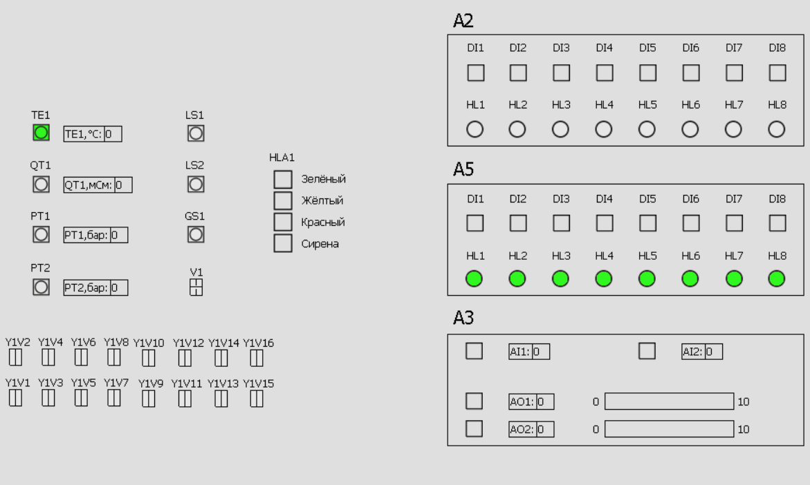

Министерство образования Республики Беларусь

Учреждение образования

«Брестский государственный технический университет»

Кафедра ИИТ

       

Лабораторная работа №5

По дисциплине «Теория и методы автоматического управления»

Тема: «Работа с контроллером AXC F 2152»

     

Выполнил:

Студент 3-го курса

Группы АС-66

Неруш Е. С.

Проверила:

Иванюк Д.С.

     

Брест 2025

---

### Ход работы
1. Клонирование репозитория проекта

Клонируем репозиторий T1-PLCnext-Demo вместе с подмодулями:

git clone --recurse-submodules https://github.com/savushkin-r-d/T1-PLCnext-Demo

2. Установка Git LFS

Устанавливаем Git LFS, необходимый для корректной загрузки бинарных файлов проекта.

3. Клонирование SCADA-компонентов

Клонируем репозиторий с компонентами EasyServer, Monitor и DbEditorXML:

git clone --recurse-submodules https://github.com/savushkin-r-d/SCADA-ptusa-bin

4. Настройка SCADA-компонентов

Выполняем настройку следующих компонентов:

DbEditorXML

EasyServer

Monitor

5. Запуск проекта

Запуск приложения осуществляется из PowerShell следующей командой:

.\ptusa_main.exe `
  --script d:/T1-PLCnext-Demo/main.plua `
  --sys_path d:/T1-PLCnext-Demo/sys `
  --extra_paths d:/T1-PLCnext-Demo/dairy-sys `
  --path d:/T1-PLCnext-Demo `
  --debug

6. Результат выполнения

В процессе запуска происходит инициализация Lua-скриптов, загрузка конфигурации и переход в основной цикл:

INFO    -> Program started (version 2025.12.1.0)
DEBUG   -> Init Lua...
NOTICE  -> script_name = "d:/T1-PLCnext-Demo/main.plua"
NOTICE  -> path = "d:/T1-PLCnext-Demo"

Device manager [64]:
      1. V1
      2. V2
      3. Y1V1                 Донный клапан
      4. Y1V10                Донный клапан
      5. Y1V11                Донный клапан
      6. Y1V12                Донный клапан
      7. Y1V13                Донный клапан
      8. Y1V14                Донный клапан
      9. Y1V15                Донный клапан
     10. Y1V16                Донный клапан
     11. Y1V2                 Донный клапан
     12. Y1V3                 Донный клапан
     13. Y1V4                 Донный клапан
     14. Y1V5                 Донный клапан
     15. Y1V6                 Донный клапан
     16. Y1V7                 Донный клапан
     17. Y1V8                 Донный клапан
     18. Y1V9                 Донный клапан
     19. LS1
     20. LS2
     21. TE1
     22. GS1
     23. FQT1
     24. QT1
     25. A2HL1
     26. A2HL2
     27. A2HL3
     28. A2HL4
     29. A2HL5
     30. A2HL6
     31. A2HL7
     32. A2HL8
     33. A5HL1
     34. A5HL2
     35. A5HL3
     36. A5HL4
     37. A5HL5
     38. A5HL6
     39. A5HL7
     40. A5HL8
     41. A2DI1
     42. A2DI2
     43. A2DI3
     44. A2DI4
     45. A2DI5
     46. A2DI6
     47. A2DI7
     48. A2DI8
     49. A5DI1
     50. A5DI2
     51. A5DI3
     52. A5DI4
     53. A5DI5
     54. A5DI6
     55. A5DI7
     56. A5DI8
     57. A3AI1
     58. A3AI2
     59. A3AO1
     60. A3AO2
     61. PT1
     62. PT2
     63. F1
     64. HLA1

Init Lua Ok.
INFO    -> Starting main loop! Sleep time is 2 ms.
Accepted connection from 127.0.0.1
G_CURRENT_PROTOCOL_VERSION = 104, host =[T1-PLCnext-Demo]
Expand commentComment on lines R64 to R80ResolvedCode has comments. Press enter to view.

Данный вывод подтверждает успешную загрузку проекта, корректную инициализацию устройств и запуск основного цикла.

7. Изменение логики запуска ламп

Перед запуском приложения был изменён файл main.plua. Логика инициализации вынесена в функцию user_init, что позволило избежать дублирования кода:

function user_init()
    local TIME = 200
    local now = get_millisec()

    A5HL8_info.start_time = now
    A5HL6_info.start_time = now
    A5HL4_info.start_time = now - TIME * 3
    A5HL2_info.start_time = A5HL4_info.start_time
    A5HL7_info.start_time = A5HL2_info.start_time - TIME / 3
    A5HL5_info.start_time = now
    A5HL3_info.start_time = A5HL5_info.start_time
    A5HL1_info.start_time = now
end

В результате была изменена последовательность включения ламп, что отразилось на поведении системы в Monitor.

 
| _Результат работы программы_