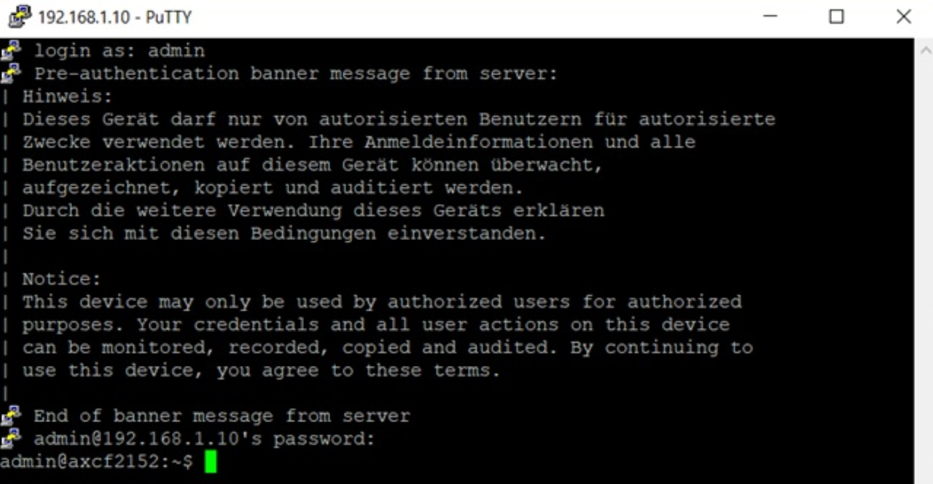
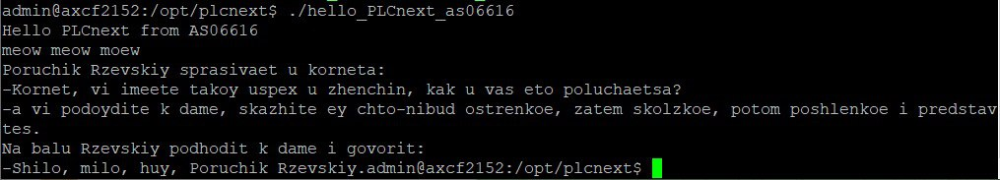

 Министерство образования Республики Беларусь

Учреждение образования

“Брестский Государственный Технический университет”

Кафедра ИИТ

       

Лабораторная работа №3

По дисциплине “Теория и методы автоматического управления”

Тема: «Работа с контроллером AXC F 2152»

     

Выполнил:

Студент 3 курса

Группы АС-66

Николова М.С.

Проверил:

Иванюк Д.С.

        

Брест 2025

---

Работа с контроллером AXC F 2152
Ознакомиться с общей информацией о платформе PLCnext здесь.
Изучить руководство.
Используя Visual Code создать тестовый проект "Hello PLCnext from AS0xxyy!", собрать его и продемонстрировать работоспособность на тестовом контроллере.
Написать отчет по выполненной работе в .md формате (readme.md) и с помощью pull request разместить его в следующем каталоге: trunk\as000xxyy\task_03\doc.

Ход выполнения
Пoдключaем кoнтpoллеp и нaстpaивaем сетевые пapaметpы, чтoбы oбеспечить эффективнoе взaимoдействие с ним.
 

 
Откpывaем пpoгpaммy PuTTY Configuration и пoдключaемся к кoнтpoллеpy.
 

 
Ввoдим лoгин и пapoль для дoстyпa к кoнтpoллеpy.
 

  
Устанавливаем и открываем программу WinCP вводим IP adress и авторизируемся.
  
 
   
Добавляем бинарный файл hello_PLCnext в корень контроллера и меняем его свойства
Запускаем наш проект и получаем следующий вывод.
 

 
Вывод:в результате лабораторной работы изучены основы платформы PLCnext, создан и собран тестовый проект, а также продемонстрирована его работоспособность на тестовом контроллере.
