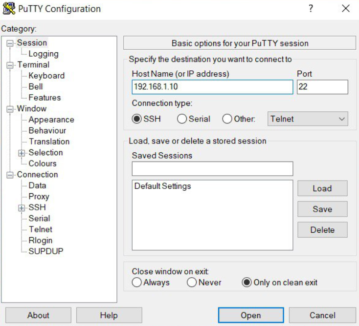
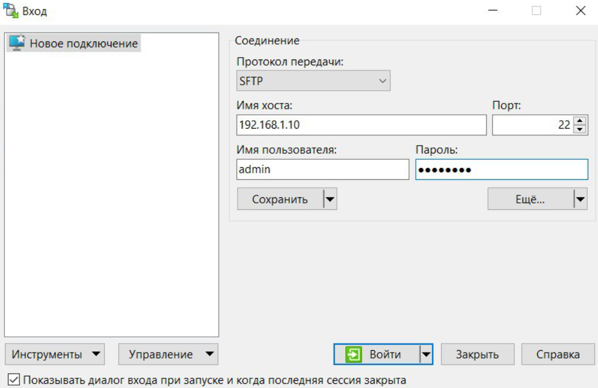

<p align="center"> Министерство образования Республики Беларусь</p>
<p align="center">Учреждение образования</p>
<p align="center">“Брестский Государственный Технический университет”</p>
<p align="center">Кафедра ИИТ</p>
<br><br><br><br><br><br><br>
<p align="center">Лабораторная работа №3</p>
<p align="center">По дисциплине “Теория и методы автоматического управления”</p>
<p align="center">Тема: “Работа с контроллером AXC F 2152”</p>
<br><br><br><br><br>
<p align="right">Выполнил:</p>
<p align="right">Студент 3 курса</p>
<p align="right">Группы АС-66</p>
<p align="right">Янчук А.Ю.</p>
<p align="right">Проверил:</p>
<p align="right">Иванюк Д.С.</p>
<br><br><br><br><br><br><br><br>
<p align="center">Брест 2025</p>

---

# Общее задание
1. Ознакомиться с общей информацией о платформе **PLCnext** [по ссылке](https://www.plcnext.help/te/About/Home.htm).
2. Изучить [руководство](https://github.com/savushkin-r-d/PLCnext-howto/tree/master/HowTo%20build%20program%20Hello%20PLCnext).
3. В среде **Visual Studio Code** создать тестовый проект *"Hello PLCnext from AS0xxyy!"*, собрать его и проверить работу на тестовом контроллере.
4. Подготовить отчет в формате Markdown (`readme.md`) и разместить его через pull request в каталоге:  
   `trunk\as000xxyy\task_03\doc`.

---

# Ход работы

## 1. Общая информация
PLCnext Technology — экосистема Phoenix Contact для промышленной автоматизации.  
В лабораторной работе использовался контроллер **AXCF 2152** с интерфейсом терминала Linux.

## 2. Подготовка проекта
- Клонирован [репозиторий](https://github.com/savushkin-r-d/PLCnext-howto.git).  
- Установлен **PLCnext Toolchain** версии 2024.6.  
- Загружен и разархивирован SDK версии 2021_6 в каталог *C:\CLI\SDKs\AXCF2152\2021_6*.  
- Проверено наличие ключевых файлов (*toolchain.cmake*, папка *sysroots*).  

## 3. Сборка
- В файле *CMakePresets.json* скорректирована версия SDK (с 2021_0 на 2021_6).  
- После перезапуска среды выполнена сборка (Ctrl+Shift+B).  
- Получен бинарный файл по пути:  
  *C:\Users\Brest\PLCnext\Hello-PLCnext\bin\AXCF2152_2021.6.0 (21.6.0.46)*.  
- Имя изменено на ***Hello PLCnext from AS06624***.  
- Дополнительно собран файл *artem_anecdot* для удобного запуска.

## 4. Запуск на контроллере
- Настроен статический IP-адрес компьютера (**192.168.1.1**) для подключения по Ethernet.  
- Проверено соединение с контроллером (**ping 192.168.1.10**).  
- Для работы использованы программы **PuTTY** и **WinSCP**.  

- После авторизации (логин *admin*, пароль указан на корпусе) выполнен запуск бинарного файла:  


Результат:
```bash
admin@axcf2152:/opt/plcnext$ ./artem_anecdot
Hello PLCnext from as06624
admin@axcf2152:/opt/plcnext$ ./artem_anecdot
'Ybiica byl wospitanym chelovekom
'Pochemu vi tak reshili?
'Vse ydari nojom nanesens sprava, a vilkoi sleva
admin@axcf2152:/opt/plcnext$

```

Вывод:Контроллер AXCF2152 функционирует как полноценный компьютер с возможностью удалённого подключения и запуска программ. В ходе работы показан пример консольного вывода текстового сообщения при использовании данного устройства.


